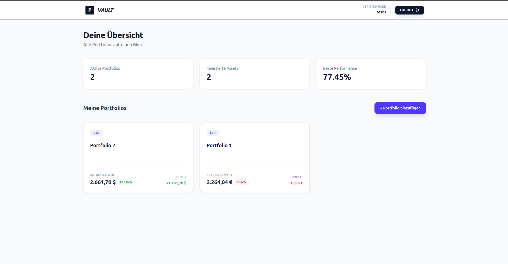
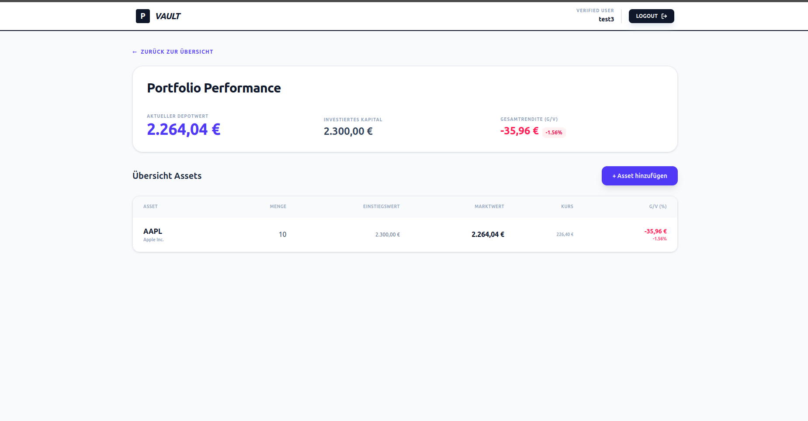
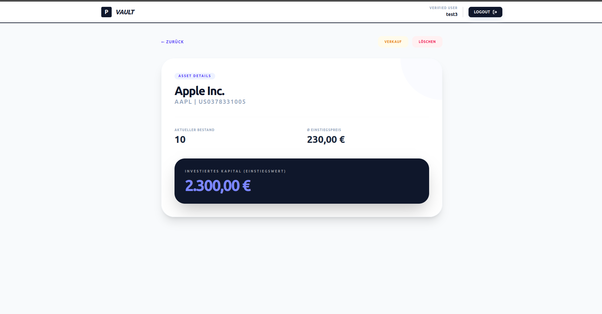

# portfolio-tracker
A robust, high-performance financial tracking application designed to manage multiple investment portfolios. This project focuses on real-time data accuracy, currency-aware calculations, and time-series optimization for long-term wealth tracking.

## 💡 Why this exists

Most commercial brokers provide limited statistical insights into long-term performance. This project was born out of the need for a more granular, broker-independent view of financial health. 

Key problems this application solves:
* **Fragmented Portfolios:** Aggregates assets spread across multiple brokers into a single, unified dashboard.
* **Detailed Trade Statistics:** Goes beyond simple "current value" displays by statistically recording every individual trade.
* **Dividend Tracking:** Specifically tracks dividend payouts to provide a complete picture of Total Return, a feature often neglected by standard broker apps.
* **Data Sovereignty:** Enables investors to analyze their data without being tied to a specific broker's interface or limited history.

 ## ✨ Key Features
* **Multi-Portfolio Management:** Create and track separate portfolios (e.g., "Retirement", "Active Trading") with individual base currencies.
* **Automated Live Pricing:** Real-time price fetching for international stocks and ETFs via financial APIs.
* **Time-Series Optimization:** Powered by **TimescaleDB** to handle millions of price points and historical snapshots with ease.
* **Currency Intelligence:** Automatic EUR/USD conversion using live exchange rates, allowing for seamless tracking of international assets.
* **Sophisticated Analytics:** Instant calculation of absolute and relative performance (Profit/Loss), entry value, and current market value.

## 📸 Screenshots

### Dashboard Overview


### Portfolio Analysis
<p align="center">
  
  
</p>

## 🛠 Tech Stack

### Backend
* **Python & FastAPI:** Chosen for its high performance, asynchronous capabilities, and excellent developer experience with automatic Swagger documentation.
* **TimescaleDB (PostgreSQL):** A specialized time-series database used to efficiently store and query millions of historical price points and portfolio snapshots.
* **SQLAlchemy (ORM):** Provides a robust abstraction layer for database interactions, ensuring type safety and clean data models.
* **Pydantic:** Utilized for rigorous data validation and settings management.
* **JWT (JSON Web Tokens):** Secure, stateless authentication for user accounts.

### Frontend
* **React (Vite):** A modern, fast frontend library for building a responsive and interactive user interface.
* **Tailwind CSS:** For a clean, professional "FinTech" aesthetic and rapid UI development.
* **Lucide React:** Consistent and modern iconography for financial data visualization.

### Data & Tools
* **Financial APIs:** Integrated real-time data fetching for global stocks, ETFs, and FX rates.
* **Decimal Precision:** Use of Python’s `decimal` module and PostgreSQL's `numeric` types to ensure cent-perfect accuracy for all financial calculations.

## 🚀 Getting Started

### Prerequisites
* Docker and Docker Compose **OR**
* Python 3.10+
* Node.js (v18+)
* PostgreSQL with TimescaleDB extension installed

### 🐳 Option 1: Docker Setup (Recommended)

The easiest way to get the entire stack up and running.

1. **Clone the repository:**
   ```bash
   git clone https://github.com/Sinnaj004/portfolio-tracker.git
   cd portfolio-tracker
   docker compose up --build
   ```

### Manual Installation

1. **Clone the repository:**
   ```bash
   git clone https://github.com/Sinnaj004/portfolio-tracker.git
   cd portfolio-tracker
   ```
2. **Backend Setup:**
   ```bash
    cd backend
    python -m venv venv
    source venv/bin/activate  # On Windows: venv\Scripts\activate
    pip install -r requirements.txt
   ```
3. **Frontend Setup:**
   ```bash
    cd ../portfolio-frontend
    npm install
   ```

### 🔑 Environment Configuration

This project uses a centralized `.env` file in the root directory to manage configurations for all services. 

Create a `.env` file in the project root and fill in your details:

```env
# --- Database Configuration ---
POSTGRES_USER=<your_db_user>
POSTGRES_PASSWORD=<your_db_password>
POSTGRES_DB=portfolio_db
POSTGRES_PORT=5432

# --- Redis Configuration ---
REDIS_URL=redis://redis:6379/0

# --- Backend Security ---
# Use a long random string for JWT encryption
SECRET_KEY=<your_secure_random_secret_key>
ACCESS_TOKEN_EXPIRE_MINUTES=60

# --- External APIs ---
# Get your key at openfigi.com
OPENFIGI_API_KEY=<your_openfigi_api_key>

# --- Frontend Configuration ---
VITE_API_URL=http://localhost:8000/api/v1
```

## 🛠 Manual Execution (Development Mode)

If you prefer to run the components separately for development or debugging, follow these steps. Ensure your local PostgreSQL (with TimescaleDB) and Redis services are running.

### 1. Backend Service (FastAPI)
The backend uses Python with FastAPI. It's recommended to use a virtual environment.

```bash
# Navigate to backend directory
cd backend

# Create and activate virtual environment
python -m venv venv
source venv/bin/activate  # On Windows: venv\Scripts\activate

# Install dependencies
pip install -r requirements.txt

# Run the server
# The --reload flag enables auto-restart on code changes
uvicorn app.main:app --reload --port 8000
```

### Frontend Service (React + Vite)
The frontend is built with React and managed by Vite for a lightning-fast development experience.

```bash
# Navigate to frontend directory
cd portfolio-frontend

# Install dependencies
npm install

# Start the development server
npm run dev
```

## 📈 Roadmap

This project is under active development. The following features are planned for future releases:

### Phase 1: Enhanced Analytics & UI
- [ ] **Historical Performance Charts:** Interactive time-series visualizations (7d, 30d, 1y, All) using **TimescaleDB**'s continuous aggregates.
- [ ] **Detailed Trade Statistics:** Statistical breakdown of individual trade performance, win/loss ratios, and average holding periods.
- [ ] **Portfolio Diversification Analysis:**
    * **Sector Allocation:** Analysis by industry (e.g., Tech, Healthcare, Energy).
    * **Geographic Exposure:** Breakdown by country/region of origin.
    * **Anti-Cluster Risk (Verklumpungsrisiko):** Detailed "look-through" analysis for ETFs to identify and visualize overlapping holdings and excessive concentration in specific stocks or regions.
- [ ] **Advanced Dividend Dashboard:** Visualizing yield on cost, monthly dividend income, and projected annual dividends.

### Phase 2: Performance & Reliability
- [ ] **Redis Caching:** Implementing a caching layer for OpenFIGI and currency exchange API responses to reduce latency and API credit usage.
- [ ] **Background Task Queue:** Using Celery/Redis for automated nightly price updates and portfolio rebalancing calculations.
- [ ] **Unit & Integration Tests:** Increasing code coverage with Pytest (Backend) and Vitest (Frontend).

### Phase 3: Reporting & Intelligence
- [ ] **PDF Export:** Generation of monthly or annual portfolio performance reports.
- [ ] **Automatic Tax Estimation:** Basic calculation of capital gains taxes based on FIFO (First-In-First-Out) logic for European markets.
- [ ] **Benchmark Comparison:** Compare portfolio performance against major indices like the S&P 500 or MSCI World.
